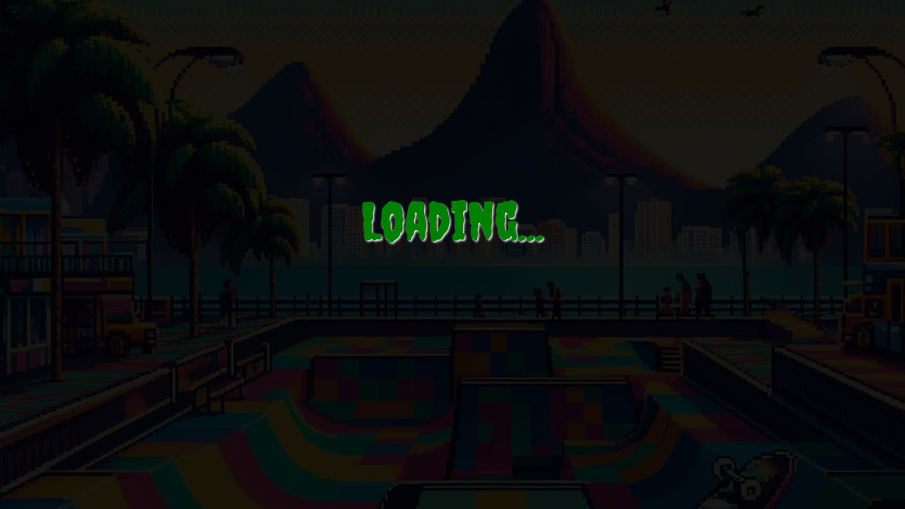
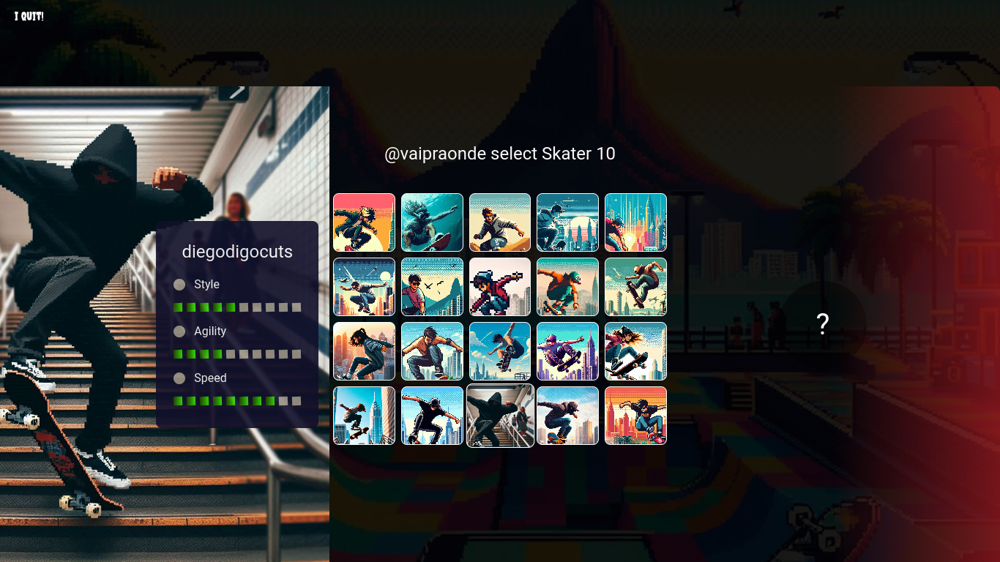

<h1 align="center">
   🛹 Skatehive Xtreme-Heroes
</h1>

<div align="center">
   <a href="https://github.com/rferrari">
      
   </a>
   <a href="https://github.com/rferrari/xtreme-heroes/commits/main">
      
   </a>
   <a href="https://github.com/rferrari/xtreme-heroes/blob/main/LICENSE.md">
      
   </a>
   
   <a href="https://github.com/JohnPetros">
      
   </a>
</div>

<br>

## 🖥️ About the App

This is a **Skaters Top Trumps Card Game**, inspired by [JohnPetros' Tekken Top Trumps Game](https://github.com/JohnPetros/tekken-top-trumps-game). The project has evolved to include new features and design by the **Skatehive Dev Team**, focusing on improved gameplay, animations, and customizations.

## 🕹️ About the Game

- Players: User (Player One) vs Bot (Player Two).
- Players choose 10 skaters each from a shared deck.
- Each skater has attributes: `Style`, `Agility`, and `Speed`.
- Players take turns selecting an attribute to compare, and the skater with the higher value wins the round.
- The losing player's skater is transferred to the winner's deck.
- The game continues until one player wins all skaters.

---

## ✨ Features

- Smooth animation feedback on all user actions.
- Contextual gameplay feedback, blocking actions when necessary.
- Card design reflects each player's ownership.
- AI-driven actions for Player Two.
- Dynamic modals display results after each round and at the game's conclusion.
- Now we have [Hive Wallet](https://hive.io/) Connection Web3 using [Aioha](https://github.com/aioha-hive/aioha).
- Animated Loading and Login Page
- Post results on the [🛹 Skatehive community](https://skatehive.app/) on the Hive Blockchain

---

## 🛠️ Technologies

- **[ReactJs](https://react.dev/)**
- **[TypeScript](https://www.typescriptlang.org/)**
- **[Framer Motion](https://www.framer.com/motion/)**
- **[Styled Components](https://styled-components.com/)**
- **[Lottie](https://lottiefiles.com/)**
- **[Hive](https://hive.io/)**
- **[Aioha](https://github.com/aioha-hive/aioha)**

---

## 🕹️ Game Play Look and Feel

|||
|-|-|
|||

---

## 🚀 How to Run This App

### Prerequisites

You'll need a package manager like pnpm to install and run the app.

```bash
# Clone this repository
$ git clone https://github.com/rferrari/xtreme-heroes.git

# Navigate to the project folder
$ cd xtreme-heroes

# Install dependencies
$ pnpm install

# Run the app in development mode
$ pnpm dev

# The app will be running on http://localhost:5173

# Build the app for production
$ pnpm build

# Start the app in procution development mode
$ pnpm start
```

---

## 💪 How to Contribute

```bash
# Fork the repository
$ git fork https://github.com/rferrari/xtreme-heroes.git

# Create a new branch for your feature
$ git checkout -b feature-name

# Commit your changes
$ git commit -m 'feat: Add new feature'

# Push your branch to the repository
$ git push origin feature-name
```

Feel free to open issues or pull requests to improve the game!

---

## 📝 License

This project is licensed under the MIT License. See the [License file](LICENSE) for details.

---

### Credits

- **Original Game by** [JohnPetros](https://github.com/JohnPetros)
- **Current Design and Development by**: Skatehive Dev Team  
   Designed by @vaipraonde  
   Developers: @devferri, @mengao, @xvlad, @alexandrefeliz, @louzado, @r4topunk

---

<p align="center">
   Made with 💜 by Skatehive Dev Team 🛹
</p>
```
